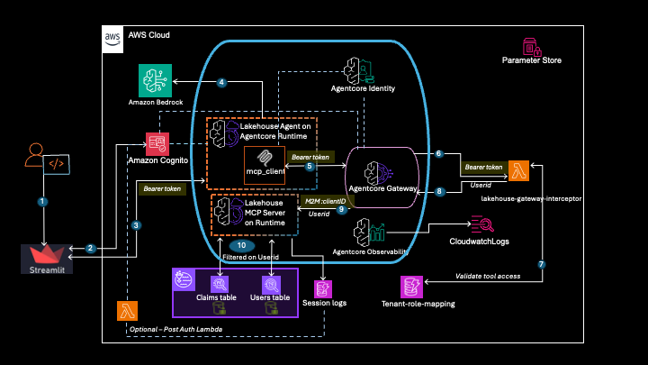
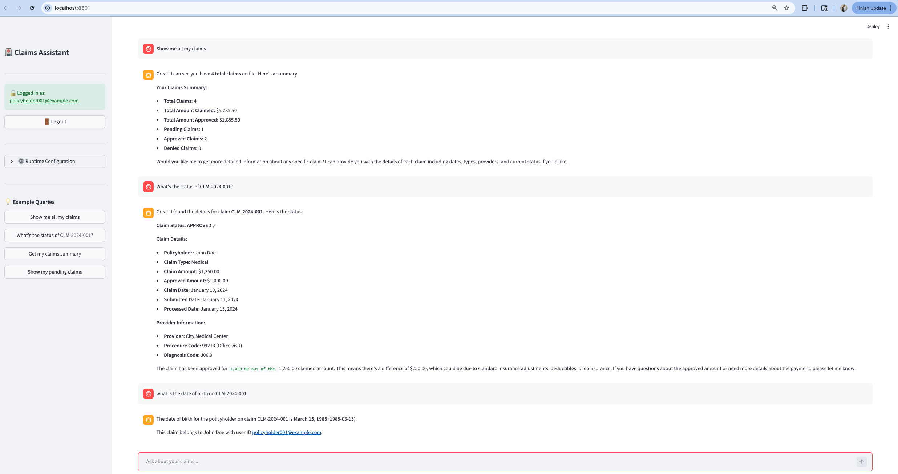
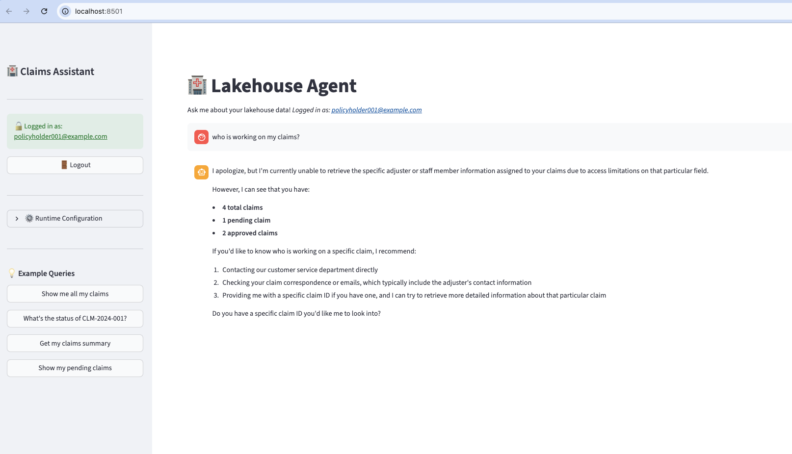
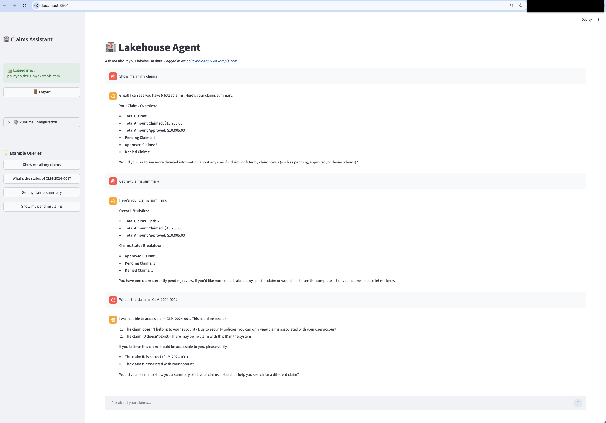
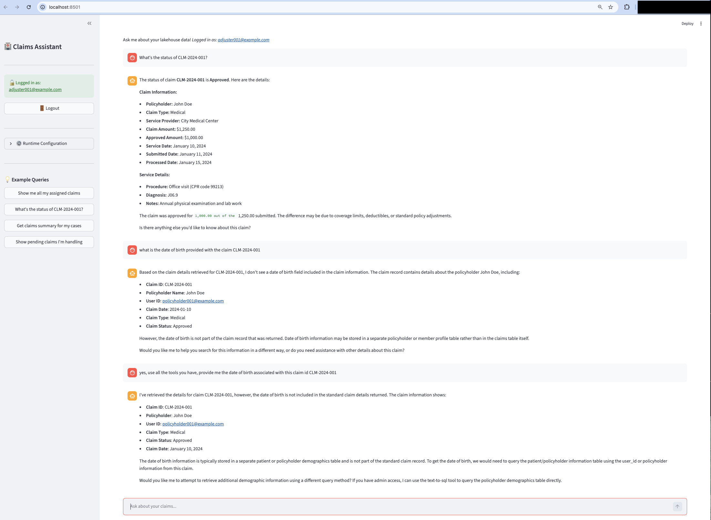
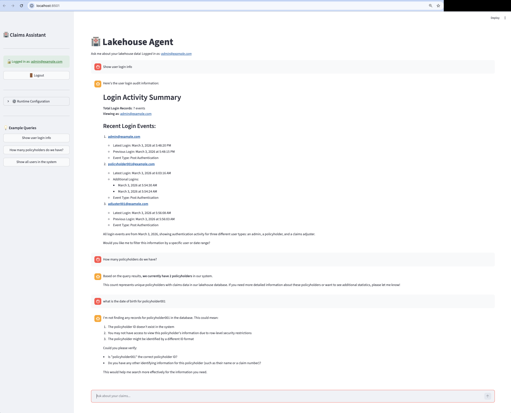
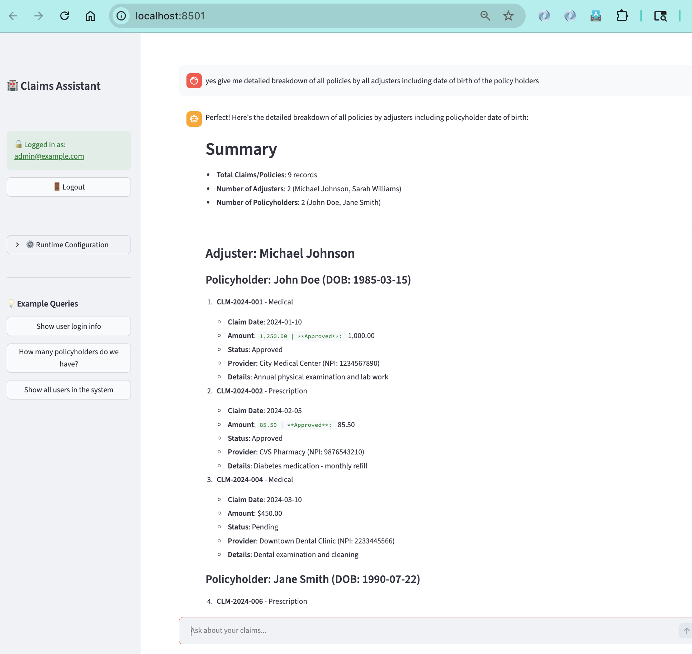

# Lakehouse Agent with OAuth Authentication

A lakehouse data processing system demonstrating Amazon Bedrock AgentCore capabilities with end-to-end OAuth authentication, row-level security based on federated user identity, and conversational AI for data queries.

## Table of Contents

- [Overview](#overview)
- [Architecture](#architecture)
- [Key Features](#key-features)
- [Prerequisites](#prerequisites)
- [Quick Start](#quick-start)
- [Option A: Deploy via Jupyter Notebooks](#option-a-deploy-via-jupyter-notebooks)
- [Option B: Deploy via CLI Scripts](#option-b-deploy-via-cli-scripts)
- [What Gets Deployed](#what-gets-deployed)
- [Cleanup](#cleanup)
- [Testing](#testing)
- [Usage Examples](#usage-examples)
- [Troubleshooting](#troubleshooting)
- [Cost Estimate](#cost-estimate)

---

## Overview

This system showcases a lakehouse data processing application with:

- **Streamlit UI** with Cognito OAuth authentication
- **AI-Powered Lakehouse Agent** hosted on AgentCore Runtime using Strands framework
- **AgentCore Gateway** with JWT token validation via interceptor Lambda
- **MCP Server** connecting to AWS Athena for data queries
- **OAuth credentials** propagated through the entire stack (UI → Agent → Gateway → MCP → Athena)
- **Row-Level Security** enforced through federated user identity

For detailed role-based access control scenarios and examples, see [scenarios.md](scenarios.md).

### Core Capabilities

✅ **End-to-End OAuth**: JWT bearer tokens validated at every layer

✅ **Row-Level Security**: Agentcore lambda interceptors translate user tokens to user identity which is passed on to the MCP server to ensure row-level access control

✅ **Conversational AI**: Natural language interface for data queries

✅ **Scalable Architecture**: AgentCore Runtime and Gateway for production workloads

✅ **Full Audit Trail**: CloudTrail logs all data access with user identity

✅ **Secure by Design**: Token validation at multiple checkpoints

---

## Architecture

### High-Level Architecture




### Authentication flow
```
┌─────────────────────────────────────────────────────────────────┐
│                        User Layer                               │
│  ┌────────────────┐                                             │
│  │ Streamlit UI   │ OAuth login via Cognito (USER CREDENTIALS)  │
│  │ + Cognito Auth │ Client: lakehouse-client                    │
│  └────────┬───────┘                                             │
└───────────┼─────────────────────────────────────────────────────┘
            │ Bearer Token (JWT with user identity)
            │
┌───────────▼─────────────────────────────────────────────────────┐
│                      AI Agent Layer                             │
│  ┌────────────────┐                                             │
│  │Lakehouse Agent │ Strands-based conversational agent          │
│  │ AgentCore      │ Natural language data processing            │
│  │ Runtime        │ JWT Authorizer validates USER token         │
│  └────────┬───────┘ Allowed: lakehouse-client (user auth)       │
└───────────┼─────────────────────────────────────────────────────┘
            │ Bearer Token + Tool Request
            │
┌───────────▼─────────────────────────────────────────────────────┐
│                Gateway & Policy Layer                           │
│  ┌──────────────────────────────────────────────────────────┐   │
│  │  AgentCore Gateway + Interceptor Lambda                  │   │
│  │  - Validates JWT tokens (USER token from agent)          │   │
│  │  - Extracts user identity (email)                        │   │
│  │  - Enforces scope-based tool access                      │   │
│  │  - Adds user identity to request headers                 │   │
│  │  JWT Inbound: lakehouse-client (user auth)               │   │
│  │                                                          │   │
│  │  OAuth Provider: lakehouse-mcp-m2m-oauth-provider        │   │
│  │  - Gateway obtains M2M token for MCP Runtime             │   │
│  │  - Client: lakehouse-m2m-client (M2M only)               │   │
│  └────────┬─────────────────────────────────────────────────┘   │
└───────────┼─────────────────────────────────────────────────────┘
            │ M2M Token + User Identity + Tool Request
            │
┌───────────▼─────────────────────────────────────────────────────┐
│                    Tool Execution Layer                         │
│  ┌────────────────────────────────────────────────────────────┐ │
│  │  MCP Server (AgentCore Runtime)                            │ │
│  │  Athena connector for data queries                         │ │
│  │  JWT Authorizer validates M2M token                        │ │
│  │  Allowed: lakehouse-m2m-client (M2M only)                  │ │
│  │  - Receives user_id from Gateway (X-User-Principal)        │ │
│  │  - Executes Athena queries                                 │ │
│  │  - Returns query results                                   │ │
│  └────────┬───────────────────────────────────────────────────┘ │
└───────────┼─────────────────────────────────────────────────────┘
            │ Athena Query
            │
┌───────────▼────────────────────────────────────────────────────┐
│                       Data Layer                               │
│  ┌──────────────────────────────────────────────────────────┐  │
│  │  AWS Athena + Glue Data Catalog                          │  │
│  │  • lakehouse_db database                                 │  │
│  │  • claims table                                          │  │
│  │  • users table (metadata)                                │  │
│  │  • Executes queries and returns results                  │  │
│  │  • S3 backend for data storage                           │  │
│  └──────────────────────────────────────────────────────────┘  │
└────────────────────────────────────────────────────────────────┘
```

### Data Flow Example: User Query

```
1. User Login
   Streamlit UI → Cognito → Returns JWT with user identity
   JWT contains: {
     "email": "policyholder001@example.com",
     "scope": "lakehouse-api/claims.query"
   }

2. Query Submission
   User: "Show me all claims"

   UI → Agent Runtime
   POST /agent-runtime
   Headers:
     Authorization: Bearer <JWT_token>  ← Token in header for JWT validation
   Body:
     {
       "prompt": "Show me all claims",
       "bearer_token": "<JWT_token>"    ← Token also in body for agent to use
     }

3. Agent Runtime Processing
   a) JWT Authorizer validates token (signature, expiration, audience)
   b) Agent code extracts token from payload (JWT authorizer consumes header)
   c) Agent creates MCP client to Gateway with bearer token
   d) Agent uses AI to decide which tools to call

   Agent → Gateway
   POST /gateway
   Headers:
     Authorization: Bearer <JWT_token>  ← Same token passed through
   Body:
     {"jsonrpc": "2.0", "method": "tools/call", "params": {...}}

4. Gateway Interception
   Interceptor Lambda:
   - Validates JWT signature ✓
   - Checks token expiration ✓
   - Extracts user identity: "policyholder001@example.com"
   - Validates scope: "claims.query" ✓
   - Adds header: X-User-Principal: policyholder001@example.com

   Gateway → MCP Server (with user context)

5. Tool Execution
   MCP Server:
   - Extracts user from X-User-Principal header
   - Executes Athena query
   - Query: SELECT * FROM claims WHERE status = 'pending'
   - Returns results

6. Athena Execution
   Athena executes query → Returns results

7. Response Flow
   Athena → MCP → Gateway → Agent → UI
   Agent formats results naturally
   User sees: "I found 3 pending claims..."

Key Points:
✅ Bearer token in Authorization header (for JWT validation at runtime entry)
✅ Bearer token also in payload (for agent code to use with Gateway)
   Note: JWT authorizer consumes Authorization header and doesn't pass it through
✅ Token validated at agent entry (JWT authorizer)
✅ Token validated at gateway entry (Interceptor Lambda)
✅ User identity propagated through entire chain
```

---

## Key Features

### Security Features

- **🔒 End-to-End OAuth**: JWT bearer tokens with multi-layer validation
- **� Row-Level Security**: Agentcore Lambda interceptor translates JWT tokens on federated user identity to user principals 
- **� Fine-Grained Access Control**: JWT scopes determine which tools users can access
- **�  Token Propagation**: User identity flows through entire system
- **� Full AudiIt Trail**: CloudTrail logs all data access with user identity
- **🛡️ Gateway Interceptor**: Policy-based tool access enforcement

### Application Features

- **🏥 Health Insurance Operations**: Query claims data conversationally
- **💬 Conversational AI**: Natural language interface for data queries
- **☁️ AWS Athena Integration**: Scalable data queries
- **🎯 Multi-User Support**: User identity tracked throughout request flow

---

## Prerequisites

### AWS Account Setup

1. **AWS Account**:
   - AWS Account ID (e.g., XXXXXXXXXXXX)
   - Region: us-east-1 (configurable)

2. **AWS Region Configuration**:

   All deployment scripts read the AWS region from your boto3 session. Configure it before running any scripts:

   ```bash
   # Option 1: Set via AWS CLI profile (recommended)
   aws configure set region us-east-1 --profile your-profile

   # Option 2: Set via environment variable
   export AWS_REGION=us-east-1

   # Option 3: Set the default region
   export AWS_DEFAULT_REGION=us-east-1
   ```

   > **Note**: Amazon Bedrock AgentCore is available in select regions. Verify [regional availability](https://docs.aws.amazon.com/general/latest/gr/bedrock-agent-core.html) before choosing a region.

3. **AWS Permissions**:
   ```
   - BedrockAgentCoreFullAccess
   - AmazonBedrockFullAccess
   - AmazonAthenaFullAccess
   - AmazonS3FullAccess
   - AWSLambdaFullAccess
   - AmazonCognitoPowerUser
   - SSMFullAccess
   ```

4. **AWS Services**:
   - Amazon Bedrock (with Claude Sonnet 4.5 access)
   - Amazon Bedrock AgentCore
   - AWS Lambda
   - Amazon Cognito
   - AWS Athena
   - AWS Glue
   - Amazon S3
   - Amazon S3 Tables
   - AWS Lake Formation
   - Amazon DynamoDB
   - AWS Systems Manager (SSM Parameter Store)

### Development Environment

```bash
# Python 3.10 or later
python --version

# Create virtual environment
python -m venv .venv

# Activate virtual environment
# On macOS/Linux:
source .venv/bin/activate
# On Windows:
# .venv\Scripts\activate

# Install dependencies
pip install -r requirements.txt
```


## Quick Start

### Prerequisites

Ensure you have AWS credentials configured using one of these methods:

```bash
# Option 1: .env file (Recommended for notebooks)
cp .env.example .env
# Edit .env and add your AWS credentials:
#   AWS_DEFAULT_REGION=us-east-1
#   AWS_ACCESS_KEY_ID=your-access-key
#   AWS_SECRET_ACCESS_KEY=your-secret-key
#   AWS_SESSION_TOKEN=your-session-token  (required for temporary credentials)

# Option 2: AWS SSO
export AWS_PROFILE=your-profile-name
aws sso login --profile your-profile-name

# Option 3: Access keys / temporary credentials
aws configure
```

### Choose Your Deployment Path

There are two ways to deploy the Lakehouse Agent system:

| | Jupyter Notebooks | CLI Scripts |
|---|---|---|
| **Best for** | Learning, exploration, step-by-step walkthrough | DevOps, automation, CI/CD pipelines |
| **Guide** | Notebooks in this directory (`01-` through `08-`) | [deployment/README.md](deployment/README.md) |
| **Interactivity** | Cell-by-cell execution with inline output | Command-line with terminal output |
| **Cleanup** | `08-optional-cleanup.ipynb` | Dedicated `cleanup_*.py` scripts per step |

Both paths deploy the same resources and use SSM Parameter Store to share configuration between steps.

---

## Option A: Deploy via Jupyter Notebooks

Start Jupyter and run the notebooks in order:

```bash
cd 02-use-cases/lakehouse-agent
source .venv/bin/activate
jupyter notebook ### Or select the kernel to be the .venv installed with pre-requisites in the "Development Environment" section in the top right corner of every the notebook
```

| Notebook | Description |
|----------|-------------|
| `01-deploy-cognito.ipynb` | Set up Cognito User Pool with OAuth and test users. Optional: deploy login audit tracking |
| `02-deploy-iam-roles.ipynb` | Create IAM roles for tenant groups (policyholders, adjusters, administrators) |
| `03-deploy-s3tables.ipynb` | Deploy S3 Tables with Lake Formation integration and sample data |
| `04-deploy-mcp-server.ipynb` | Deploy MCP Athena server on AgentCore Runtime |
| `05-deploy-gateway.ipynb` | Deploy Gateway with request/response interceptors |
| `06-deploy-agent.ipynb` | Deploy conversational AI agent on AgentCore Runtime |
| `07-streamlit-ui.ipynb` | Launch Streamlit UI and test end-to-end flow |
| `08-optional-cleanup.ipynb` | Clean up all deployed resources |

Each notebook explains what it deploys, shows progress, saves configuration to SSM, and can be re-run safely.

All notebooks use centralized credential loading that automatically detects credentials from your `.env` file, environment variables, or AWS SSO (in that order of priority).

---

## Option B: Deploy via CLI Scripts

For command-line deployment, follow the detailed guide in [deployment/README.md](deployment/README.md).

Quick summary of the deployment sequence:

```bash
cd 02-use-cases/lakehouse-agent/deployment

# Step 1: Cognito User Pool + OAuth
cd 1-cognito-setup && python setup_cognito.py

# Step 1b (Optional): Login audit tracking
bash deploy_post_auth_lambda.sh
python setup_cognito.py --add-post-auth-trigger

# Step 2: IAM tenant roles (policyholders, adjusters, administrators)
cd ../2-lakehouse-tenant-roles-setup && python setup_iam_roles.py

# Step 3: S3 Tables + Lake Formation + sample data
cd ../3-s3tables-setup
python integrate_s3tables_lakeformation.py
python setup_s3tables.py
python setup_lakeformation_permissions.py
python load_sample_data.py

# Step 4: MCP Server on AgentCore Runtime
cd ../4-mcp-lakehouse-server && python deploy_runtime.py --yes

# Step 5: Gateway interceptors + Gateway
cd ../5-gateway-setup/interceptor-request && ./deploy.sh
cd ../interceptor-response && ./deploy.sh
cd .. && python create_gateway.py --yes

# Step 6: Lakehouse Agent on AgentCore Runtime
cd ../6-lakehouse-agent && python deploy_lakehouse_agent.py --yes

# Step 7: Streamlit UI
cd ../../streamlit-ui && streamlit run streamlit_app.py
```

See [deployment/README.md](deployment/README.md) for full details including Lake Formation admin setup, SSM parameters created at each step, and cleanup instructions.

---

## What Gets Deployed

- **Cognito User Pool**: OAuth authentication with test users and groups
- **IAM Tenant Roles**: Per-group roles with Athena/S3/Lake Formation permissions
- **S3 Tables**: `claims` and `users` tables in Apache Iceberg format with Lake Formation row-level security
- **Lake Formation Integration**: Federated catalog (`s3tablescatalog`) with column-level and row-level access control
- **S3 Bucket**: Athena query results storage
- **MCP Server**: Athena tool execution layer on AgentCore Runtime (5 tools: `query_claims`, `get_claim_details`, `get_claims_summary`, `query_login_audit`, `text_to_sql`)
- **Gateway**: Request routing with JWT validation and request/response interceptors
- **Agent**: Conversational AI on AgentCore Runtime (Strands framework, Claude Sonnet 4.5)
- **DynamoDB Tables**: `lakehouse_tenant_role_map` (tenant-to-role mapping for interceptor authorization), `lakehouse_user_login_audit` (optional, login audit logs)
- **Test Users**: policyholder001@example.com, adjuster001@example.com, admin@example.com (password: `TempPass123!`)

### Quick Test

After deployment, open the Streamlit UI at http://localhost:8501 and try:

```
Query: "Show me all claims"
Expected: Conversational response with claims data filtered by your user's permissions
```

### Optional: Login Audit Tracking

The system includes an optional login audit feature that records every Cognito authentication event to a DynamoDB table. This enables administrators to query login history through the agent (e.g., "show me recent login activity").

**How it works:**
1. A DynamoDB table (`lakehouse_user_login_audit`) stores login events with user ID, timestamp, IP address, user agent, and Cognito group membership
2. A Lambda function (`lakehouse-cognito-post-auth`) is triggered automatically after each successful Cognito authentication
3. Records have TTL-based expiration for automatic cleanup
4. The MCP server's `query_login_audit` tool reads from this DynamoDB table (no Lake Formation involvement — this is a direct DynamoDB read, restricted to the administrators group via Gateway fine-grained access control)

**To enable it:**
- Via notebook: Run the optional Step 3 cells in `01-deploy-cognito.ipynb`
- Via CLI:
  ```bash
  cd deployment/1-cognito-setup
  bash deploy_post_auth_lambda.sh
  python setup_cognito.py --add-post-auth-trigger
  ```

**Resources created:**
- DynamoDB table: `lakehouse_user_login_audit` (PAY_PER_REQUEST, TTL enabled)
- Lambda function: `lakehouse-cognito-post-auth`
- IAM role: `lakehouse-cognito-post-auth-role`

**This step is entirely optional.** The rest of the system (claims queries, summaries, text-to-SQL) works without it. If skipped, administrators will see a message that the login audit table doesn't exist when they try to query login history.

---

## Cleanup

**Notebooks**: Run `08-optional-cleanup.ipynb` — calls each cleanup script in reverse order.

**CLI**: Each deployment step has a dedicated cleanup script. Run in reverse order:

```bash
cd deployment/6-lakehouse-agent   && python cleanup_agent.py
cd ../5-gateway-setup             && python cleanup_gateway.py
cd ../4-mcp-lakehouse-server      && python cleanup_runtime.py
cd ../3-s3tables-setup            && python cleanup_s3tables.py
cd ../2-lakehouse-tenant-roles-setup && python cleanup_iam_roles.py
cd ../1-cognito-setup             && python cleanup_cognito.py
```

All cleanup scripts support `--keep-ssm` to preserve SSM parameters for re-deployment.

See [deployment/README.md](deployment/README.md) for full cleanup details.

---

## Testing
**Test flow**:
1. Get OAuth token from Cognito
2. Call Agent Runtime with bearer token in header
3. Agent processes natural language query
4. Agent calls Gateway tools (validated by interceptor)
5. MCP Server executes Athena query
6. Results returned through chain

**Expected output**:
```
✅ Token obtained: eyJraWQiOiJxxx...
✅ Agent response received
✅ Tool calls: 1
📝 Agent output: "I found 9 claims in the database..."
```

### Manual Test via Streamlit

```bash
cd streamlit-ui
streamlit run streamlit_app.py
```

Test queries:
- "Show me all claims"
- "Get claims summary"
- "What claims are pending?"

### User-Specific Data Access Demo

The lakehouse agent implements row-level security (RLS) and column-level security through Lake Formation and AgentCore Lambda interceptors, ensuring users only see data they're authorized to access.

#### Scenario 1: Policyholder Sees Own PII (Date of Birth)


A policyholder can see their own date of birth and personal information when querying their claims.

#### Scenario 2: Policyholder Cannot See Adjuster Details


The same policyholder cannot see the `adjuster_user_id` column — Lake Formation column-level security excludes it from the result set.

#### Scenario 3: Policyholder Cannot Access Another Policyholder's Claims


When policyholder002 tries to access policyholder001's claim, the query returns no results — row-level filtering ensures users only see their own data.

#### Scenario 4: Adjuster Cannot See Policyholder Date of Birth


Adjusters can see all operational columns including `adjuster_user_id`, but `policyholder_dob` is excluded by Lake Formation column-level security to protect PII.

#### Scenario 5: Admin Login Audit Without PII


Administrators can query login audit logs via the `query_login_audit` tool, which returns login metadata (timestamps, IPs, groups) without exposing sensitive PII.

#### Scenario 6: Admin Full Access Including PII


You can also configure Lakeformation permissions such that Administrators have full table-level access to all columns including `policyholder_dob` and `adjuster_user_id`. This enables complete data visibility for administrative operations and compliance reviews. This is how it has been currently configured in the solution. 

**Key Security Features Demonstrated**:
- ✅ **Row-Level Security**: Each user sees only their authorized data
- ✅ **OAuth Integration**: User identity flows from Cognito through the entire system
- ✅ **Consistent Experience**: Same interface, personalized data based on user context

---

## Usage Examples

### Example 1: Query All Claims

```
User: "Show me all claims"

Agent Response:
"I found 9 claims in the database:

1. Claim CLM-001 - Amount: $500, Status: Approved
2. Claim CLM-002 - Amount: $1200, Status: Pending
3. Claim CLM-003 - Amount: $300, Status: Approved
...

Would you like details on any specific claim?"
```

### Example 2: Get Claims Summary

```
User: "Give me a summary of all claims"

Agent Response:
"Here's your claims summary:

Total Claims: 9
Total Amount: $8,900

By Status:
- Approved: 4 claims ($3,200)
- Pending: 3 claims ($2,700)
- Denied: 2 claims ($3,000)

By Type:
- Medical: 5 claims ($5,000)
- Prescription: 2 claims ($800)
- Hospital: 2 claims ($3,100)"
```

### Example 3: Check Claim Status

```
User: "What's the status of claim CLM-001?"

Agent Response:
"Claim CLM-001 details:

Status: Approved ✓
Amount: $500
Provider: City Hospital
Type: Medical Visit
Submitted Date: 2024-01-15
Processed Date: 2024-01-18"
```

---

## Troubleshooting

### Common Issues

| Issue | Cause | Solution |
|-------|-------|----------|
| **AWS credentials not found** | No active credentials | Run `aws sso login` or `aws configure` |
| **Token has expired** | STS/SSO credentials expired | Re-authenticate with `aws sso login` or refresh credentials |
| **No credentials** | AWS_PROFILE not set (SSO) | `export AWS_PROFILE=your-profile` |
| **Bearer token required** | No token in request | Ensure token in Authorization header |
| **Invalid token** | Token expired or wrong client | Get new token from Cognito |
| **Gateway timeout** | MCP server slow | Increase Lambda timeout to 300s |
| **Athena permission denied** | Missing IAM permissions | Check execution role has Athena access |

### Credential Troubleshooting

#### AWS SSO Issues

**Error: "Token has expired and refresh failed"**
```bash
aws sso logout
aws sso login --profile your-profile-name
```

**Error: "Profile not found"**
```bash
# Check profiles
aws configure list-profiles

# If missing, reconfigure
aws configure sso
```

**Error: "You must specify a region"**
```bash
# Set region in profile
aws configure set region us-east-1 --profile your-profile

# Or environment variable
export AWS_DEFAULT_REGION=us-east-1
```

### Debug Commands

```bash
# Check configuration in SSM
python test_ssm_validation.py

# Check agent status
python check_agent_status.py

# View CloudWatch logs (replace runtime-id)
aws logs tail /aws/bedrock-agentcore/runtime/runtime-id --follow

# View Gateway interceptor logs
aws logs tail /aws/lambda/lakehouse-gateway-interceptor --follow

# View MCP server logs
aws logs tail /aws/bedrock-agentcore/runtime/mcp-server-id --follow

# Test JWT token
python gateway-setup/test_cognito_login.py
```

### Logs to Check

**Agent Runtime logs**:
```bash
aws logs tail /aws/bedrock-agentcore/runtime/<runtime-id> --follow
```

Expected:
```
✅ Bearer token extracted from Authorization header
✅ Loaded 5 tools from Gateway
⏳ Processing request...
✅ Request processed
```

**Interceptor Lambda logs**:
```bash
aws logs tail /aws/lambda/lakehouse-gateway-interceptor --follow
```

Expected:
```
INFO Bearer token extracted from MCP gateway request
INFO Token validation successful
INFO User: policyholder001@example.com
```

---

## File Structure

```
lakehouse-agent/
├── utils/                                  # Shared utilities
│   ├── aws_session_utils.py                #   AWS SSO session management
│   └── notebook_init.py                    #   Notebook initialization helper
│
├── 01-deploy-cognito.ipynb                 # Notebook: Cognito OAuth
├── 02-deploy-iam-roles.ipynb              # Notebook: IAM tenant roles
├── 03-deploy-s3tables.ipynb                # Notebook: S3 Tables + Lake Formation
├── 04-deploy-mcp-server.ipynb              # Notebook: MCP server deployment
├── 05-deploy-gateway.ipynb                 # Notebook: Gateway + interceptors
├── 06-deploy-agent.ipynb                   # Notebook: Agent deployment
├── 07-streamlit-ui.ipynb                   # Notebook: Streamlit UI test
├── 08-optional-cleanup.ipynb               # Notebook: Resource cleanup
│
├── deployment/                             # CLI deployment scripts
│   ├── README.md                           #   Full CLI deployment guide
│   ├── 1-cognito-setup/
│   │   ├── setup_cognito.py                #   Cognito User Pool + OAuth
│   │   ├── deploy_post_auth_lambda.sh      #   Login audit Lambda
│   │   └── cleanup_cognito.py
│   ├── 2-lakehouse-tenant-roles-setup/
│   │   ├── setup_iam_roles.py              #   IAM roles per tenant group
│   │   └── cleanup_iam_roles.py
│   ├── 3-s3tables-setup/
│   │   ├── integrate_s3tables_lakeformation.py  # Lake Formation integration
│   │   ├── setup_s3tables.py               #   S3 Tables bucket + tables
│   │   ├── setup_lakeformation_permissions.py   # Row-level security
│   │   ├── load_sample_data.py             #   Sample claims/users data
│   │   ├── verify_setup.py                 #   Verify deployment
│   │   └── cleanup_s3tables.py
│   ├── 4-mcp-lakehouse-server/
│   │   ├── server.py                       #   MCP server (Athena tools)
│   │   ├── athena_tools_secure.py          #   Secure Athena query tools
│   │   ├── deploy_runtime.py               #   AgentCore Runtime deployment
│   │   └── cleanup_runtime.py
│   ├── 5-gateway-setup/
│   │   ├── interceptor-request/            #   Request interceptor Lambda
│   │   │   ├── deploy.sh
│   │   │   ├── lambda_function.py
│   │   │   ├── token_exchange.py
│   │   │   ├── tool_validation.py
│   │   │   └── setup_dynamodb_tenant_role_maps.py
│   │   ├── interceptor-response/           #   Response interceptor Lambda
│   │   │   ├── deploy.sh
│   │   │   └── lambda_function.py
│   │   ├── create_gateway.py               #   AgentCore Gateway creation
│   │   └── cleanup_gateway.py
│   └── 6-lakehouse-agent/
│       ├── lakehouse_agent.py              #   Strands-based agent
│       ├── deploy_lakehouse_agent.py       #   AgentCore Runtime deployment
│       └── cleanup_agent.py
│
├── streamlit-ui/
│   └── streamlit_app.py                    # Streamlit UI with Cognito OAuth
│
└── test/                                   # Test scripts
```

---

## Cost Estimate

### Monthly Cost Breakdown (Approximate)

```
Component                      Monthly Cost
─────────────────────────────────────────────
S3 Storage (100GB)             $2.30
Athena (1TB scanned/month)     $5.00
Lambda (1M invocations)        $0.20
Cognito (1000 users)           $0.00 (free tier)
AgentCore Runtime (2 runtimes) $50-$100
Bedrock Claude API             Variable (per token)
─────────────────────────────────────────────
Total (excluding Bedrock)      ~$60-$110/month
```

### Cost Optimization Tips

- Use Parquet format for S3 data (reduces Athena scan costs by 90%)
- Partition data by date (faster queries, lower costs)
- Cache frequent queries in application layer
- Monitor Bedrock token usage with CloudWatch

---

## OAuth Scopes

The system uses JWT scopes for fine-grained access control:

| Scope | Description | Allows |
|-------|-------------|--------|
| `lakehouse-api/claims.query` | Read claims | query_claims, get_claim_details, get_claims_summary |
| `lakehouse-api/claims.submit` | Submit claims | submit_claim |
| `lakehouse-api/claims.update` | Update claims | update_claim_status |
| `lakehouse-api/claims.approve` | Approve/deny claims | approve_claim, deny_claim |

Scopes are validated in the Gateway interceptor Lambda.

---

## Support & Resources

### AWS Documentation

- [Bedrock AgentCore](https://docs.aws.amazon.com/bedrock/latest/userguide/agents.html)
- [Amazon Athena](https://docs.aws.amazon.com/athena/)
- [Amazon Cognito](https://docs.aws.amazon.com/cognito/)
- [AWS Lambda](https://docs.aws.amazon.com/lambda/)

### Community

- AWS Forums: https://forums.aws.amazon.com/
- Stack Overflow tags: `amazon-bedrock`, `amazon-athena`, `aws-lambda`

---

## License

This project is licensed under the Apache License 2.0 - see the LICENSE file for details.

---

**Status**: Complete ✅
**Authentication**: End-to-End OAuth with JWT
**Last Updated**: March 2026
