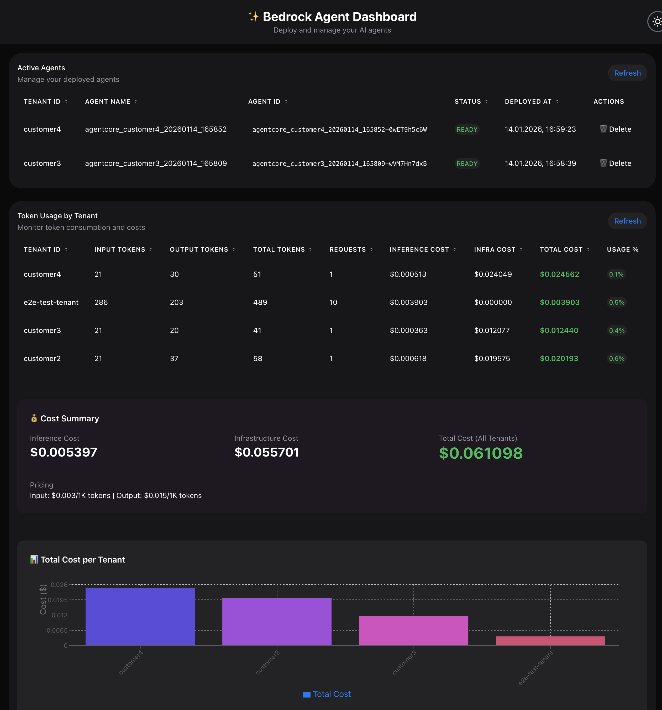
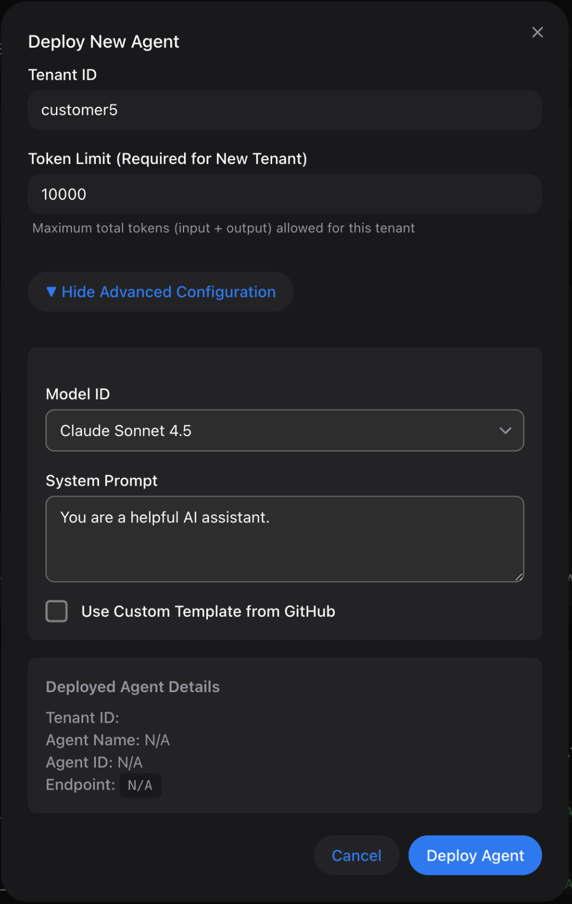
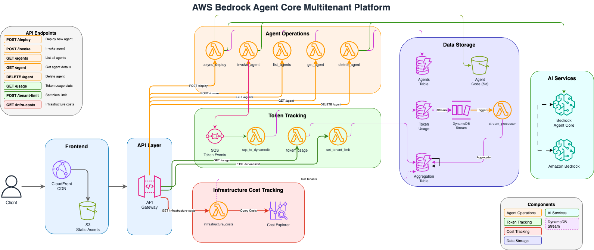
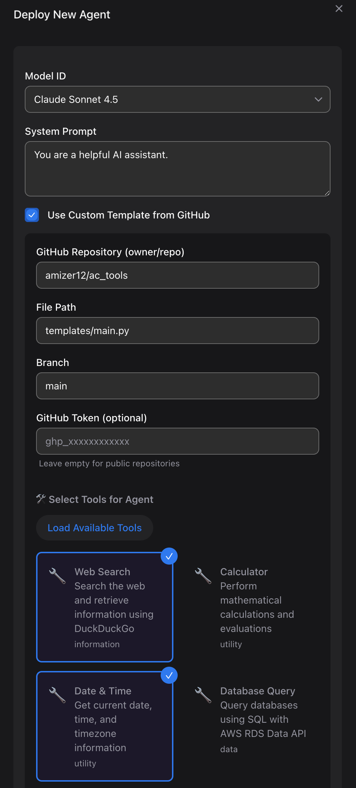

# AWS Bedrock Agent Core Multitenant Platform

A multi-tenant SaaS platform for deploying, managing, and invoking AI agents powered by AWS Bedrock Agent Core.

<p align="center">
  
</p>

## Features

- **Deploy Custom AI Agents**: Configure agents with custom models (Claude Sonnet 4.5), system prompts, and modular tools
- **Modular Tool Composition**: Select from 6+ tools (web search, calculator, database query, email, web crawler, etc.)
- **Multi-Tenant Isolation**: Each agent tagged with tenant ID for cost tracking
- **Token Limits per Tenant**: Set and enforce token usage limits with automatic 429 responses when exceeded
- **Real-Time Token Usage Tracking**: Monitor inference costs per tenant with aggregated metrics and usage percentages
- **Infrastructure Cost Tracking**: Track AWS infrastructure costs per tenant using cost allocation tags via AWS Cost Explorer
- **Total Cost Dashboard**: View combined inference + infrastructure costs per tenant with detailed breakdowns
- **Agent Management**: List, invoke, update, and delete agents via REST API
- **Interactive Dashboard**: React-based UI with dark mode, charts, auto-refresh, and real-time updates

<p align="center">
  
</p>

## Architecture



The system architecture consists of the following components:


### Component Overview

| Component | Service | Purpose |
|-----------|---------|---------|
| Frontend | CloudFront + S3 | React dashboard with HeroUI v3 |
| API | API Gateway | REST API with 9 endpoints |
| Agent Ops | Lambda (5) | Deploy, invoke, list, get, delete agents |
| Token Tracking | Lambda (3) + SQS | Real-time usage aggregation |
| Cost Tracking | Lambda (1) + Cost Explorer | Infrastructure cost per tenant |
| Storage | DynamoDB (4) | Agents, tokens, config, aggregates |
| AI | Bedrock Agent Core | Claude Sonnet 4.5 model |

### Data Flow

**Agent Deployment**:
```
Frontend → API Gateway → async_deploy → build_deploy → S3 + Bedrock → DynamoDB
```

**Agent Invocation with Token Limits**:
```
Frontend → API Gateway → invoke_agent → Check Limit → Bedrock → SQS → Aggregate
```

**Token Tracking Pipeline**:
```
SQS → sqs_to_dynamodb → DynamoDB → Stream → Aggregation → Dashboard
```

**Infrastructure Cost Tracking**:
```
Frontend → API Gateway → infrastructure_costs → Cost Explorer (tenantId tag) → Dashboard
```

## Project Structure

```
.
├── agent-tools-repo/         # Modular tool repository for agent composition
├── docs/                     # Architecture diagrams and documentation
├── frontend/                 # React dashboard application
├── src/                      # Backend infrastructure and Lambda functions
│   ├── lambda_functions/     # Lambda function handlers
│   ├── stacks/               # CDK stack definitions
│   └── cdk_app.py           # CDK application entry point
├── deploy.sh                 # One-command deployment script
└── README.md                # This file
```

## Prerequisites

- AWS CLI configured with credentials
- Node.js 18+ and npm
- Python 3.10+
- AWS CDK CLI (`npm install -g aws-cdk`)
- CDK bootstrapped in your AWS account/region

## Deployment

### Deployment (Default Region: us-east-1)

```bash
chmod a+x deploy.sh

./deploy.sh
```

This script will:
1. Install frontend dependencies
2. Build the React application
3. Deploy the entire CDK stack (infrastructure + frontend)
4. **Automatically generate config.js** with the API endpoint and other non‑secret configuration (⚠️ See Security Considerations below)
5. Deploy frontend to S3 and CloudFront
6. Invalidate CloudFront cache

> **⚠️ Security Note**: Do **not** embed API Gateway keys or other long‑lived credentials in publicly accessible files such as `config.js`. For production deployments, use authenticated callers (for example, Cognito/IAM/JWT) or a backend proxy/BFF that keeps credentials server‑side and issues short‑lived, scoped tokens to the frontend instead. See the [Security Considerations](#security-considerations) section for detailed production recommendations.

### Deploy to a Specific Region

The deployment script respects the `AWS_DEFAULT_REGION` environment variable. To deploy to a different AWS region:

```bash
# Deploy to eu-central-1 (Frankfurt)
AWS_DEFAULT_REGION=eu-central-1 ./deploy.sh

# Deploy to us-west-2 (Oregon)
AWS_DEFAULT_REGION=us-west-2 ./deploy.sh

# Deploy to ap-southeast-1 (Singapore)
AWS_DEFAULT_REGION=ap-southeast-1 ./deploy.sh
```

**Region Configuration:**
- Default region: `us-east-1` (if not specified)
- The script reads from `AWS_DEFAULT_REGION` environment variable
- The region is displayed during deployment: "Deploying to region: [region]"
- The script internally sets `CDK_DEFAULT_REGION` for CDK commands

**Important Notes:**
- The region must support AWS Bedrock Agent Core
- You must bootstrap CDK in the target region first (see below)
- Each region deployment creates a separate, independent stack
- Resource names include the region to avoid conflicts

### Bootstrap a New Region

Before deploying to a new region for the first time:

```bash
# Bootstrap the target region (replace with your account ID)
AWS_DEFAULT_REGION=eu-central-1 cdk bootstrap aws://YOUR_ACCOUNT_ID/eu-central-1

# Or let CDK auto-detect your account
AWS_DEFAULT_REGION=eu-central-1 cdk bootstrap
```

### Manual CDK Deployment (Without Frontend Build)

```bash
# Deploy to default region (us-east-1)
cd src && cdk deploy --app "python3 cdk_app.py"

# Deploy to specific region
cd src && AWS_DEFAULT_REGION=eu-central-1 cdk deploy --app "python3 cdk_app.py"
```

### What Gets Deployed

- **API Gateway**: REST API with 7 endpoints
- **Lambda Functions**: 12 functions for agent operations
- **DynamoDB Tables**: 4 tables for agents, config, and token tracking
- **SQS Queue**: For asynchronous token usage processing
- **S3 Buckets**: For agent code and frontend hosting
- **CloudFront**: CDN for frontend distribution
- **IAM Roles**: With least-privilege permissions

## Stack Outputs

After deployment, you'll see outputs including:

- `FrontendUrl`: CloudFront URL for the dashboard
- `ApiEndpoint`: API Gateway endpoint
- `ApiKeyId`: API key ID (value is auto-injected into frontend)
- `CodeBucket`: S3 bucket for agent code
- `QueueUrl`: SQS queue for token tracking

## Usage

### Security Considerations

**⚠️ IMPORTANT: This blueprint is designed for demonstration and development purposes.**

### Getting Started

1. Visit the CloudFront URL from the stack outputs
2. Enter a tenant ID
3. Configure your agent (model, system prompt, tools)
4. Click "Deploy Agent"
5. Once deployed, invoke the agent from the dashboard
6. Monitor token usage and costs in real-time

## Development

### Local Frontend Development

```bash
cd frontend
npm install
npm run dev
```

The frontend will run on `http://localhost:3000` and use the deployed API.

### Redeploy After Changes

```bash
./deploy.sh
```

The config.js will be automatically regenerated with the latest API credentials.

> **⚠️ Security Reminder**: The API key is embedded in the frontend config.js file. This architecture is suitable for demos and internal tools only. For production deployments, implement proper authentication (see [Security Considerations](#security-considerations)).

## Cost Tracking

The platform provides comprehensive cost tracking with two components:

### Inference Costs
- Tracks token usage per agent invocation
- Calculates costs based on input/output token pricing
- Aggregates costs by tenant ID
- Displays usage percentages against token limits

### Infrastructure Costs
- Queries AWS Cost Explorer for infrastructure costs
- Filters by `tenantId` cost allocation tag
- Retrieves current month costs per tenant
- Only tracks costs for currently configured tenants

### Dashboard Display
- **Inference Cost**: Token-based costs from Bedrock usage
- **Infra Cost**: AWS infrastructure costs (Lambda, DynamoDB, etc.)
- **Total Cost**: Combined inference + infrastructure costs
- **Cost Chart**: Visual breakdown with detailed tooltips
- **Auto-refresh**: Updates every 10 seconds

> **Note**: Infrastructure costs from AWS Cost Explorer may be delayed up to 24 hours for new resources.

## Cleanup

To delete all resources:

```bash
# Delete from default region (us-east-1)
cdk destroy --app "python3 src/cdk_app.py"

# Delete from specific region
AWS_DEFAULT_REGION=eu-central-1 cdk destroy --app "python3 src/cdk_app.py"
```

**Note:** All resources are configured with automatic deletion policies:
- S3 buckets are automatically emptied before deletion
- CloudWatch log groups are automatically removed
- DynamoDB tables are deleted with their data
- No manual cleanup required

## Adding your custom tool into deployment (Optional)

To deploy agents with your own custom tools, create a custom tool repository based on the included `agent-tools-repo` template. During agent deployment, provide the URL to your repository, load your tool definitions, select the applicable tools, and deploy the agent with them.

<p align="center">
  
</p>

### 1. Clone the Agent Tools Repository

```bash
# Create a new repository from the agent-tools-repo template
cp -r agent-tools-repo/ac_tools my-custom-tools
cd my-custom-tools

# Initialize as a new git repository
git init
git add .
git commit -m "Initial commit: Custom agent tools"

# Push to your GitHub repository
git remote add origin https://github.com/YOUR_USERNAME/my-custom-tools.git
git push -u origin main
```

### 2. Add Your Custom Tools

Create a new tool in the `tools/` directory:

```bash
mkdir tools/my-custom-tool
```

Create `tools/my-custom-tool/tool.py`:
```python
from strands import tool

@tool
def my_custom_tool(input: str) -> str:
    """Description of what your tool does"""
    # Your tool implementation
    return f"Processed: {input}"
```

Create `tools/my-custom-tool/config.json`:
```json
{
  "id": "my-custom-tool",
  "name": "My Custom Tool",
  "description": "Description of your custom tool",
  "category": "utility",
  "version": "1.0.0"
}
```

### 3. Update the Tool Catalog

Edit `catalog.json` to include your new tool:
```json
{
  "tools": [
    {
      "id": "my-custom-tool",
      "name": "My Custom Tool",
      "description": "Description of your custom tool",
      "category": "utility",
      "path": "tools/my-custom-tool"
    }
  ]
}
```

### 4. Push Changes to GitHub

```bash
git add .
git commit -m "Add custom tool"
git push
```

### 5. Use Your Custom Tools in Agent Deployment

When deploying an agent through the dashboard:

1. Click "Deploy New Agent"
2. Expand "Advanced Configuration"
3. Check "Use Custom Template from GitHub"
4. Enter your repository: `YOUR_USERNAME/my-custom-tools`
5. Click "Load Available Tools"
6. Select your custom tools
7. Deploy the agent

The deployment system will fetch your `catalog.json`, display your custom tools, and bundle them with the agent code.

> **Tip**: You can make your repository private and provide a GitHub Personal Access Token in the deployment form for private tool repositories.

## License

MIT

